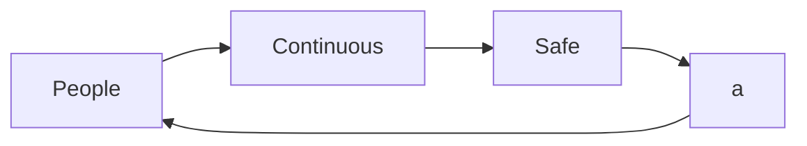
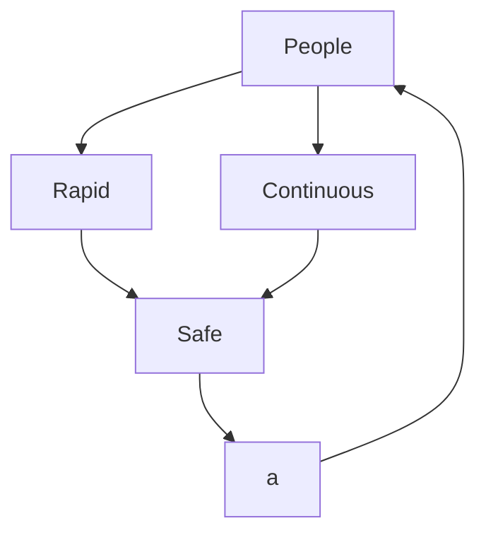

_brief_: https://github.com/infchg/j2?  _former_: https://infchg.github.io/QI?
  
#  🌌 Thinking about fundamental questions

- Interest: Physics, Quantum Information, inter-disciplinary collaboration [planned 2022-23](#planned-2022-23)
- Steps taken: published on [](#Physics-Based-Information-Models), researching [QI-Tools-Applications](#QI-Tools-Applications)
- Experienced: achieved complex IT goals integrating Teams, Hardware, Instruments, Bus, Linux, Network, DevOps, Python, Cloud 

Generic & Simple frameworks boost human innovation, helping rapid building & repetition:
   In the 70s, the DoD's Internet Protocol made easy to grow communications exponentially. In the 90’s the CERN's Web open format radically boosted the information exchange. In 201x's IBM's QisKit started seamless access to Quantum Computers for hundreds of thousands researchers. 

 
# Planned 2022-23

Part-time Due to completing a tech project full-time currently:

- 2022 submitting new journal paper on Bloch & QI framework 
- 2023 Q1Q2 collaborations nearby NY towards cloud quantum computing

#  🌱 Physics-Based Information Models 

Proposed Physics-Based Models (alike Toffoli, Benioff, Kirchoff) and Feynman-charts of Information Change.

 -   "Simulation model applied to IP protocols and satellite communications", Int'l Conf. Advances in Satellite and Space Communications, 2010, pp.122–127, Martínez, J.C., De Haro, L., González, A. https://IEEExplore.IEEE.org/document/5502488 DOI.org/10.1109/spacomm.2010.34 ISBN:9781424472758 on QKD
 -   "Particle-based methodology for representing mobile ad-hoc networks", Int'l Conf. Integrated internet ad hoc and sensor networks ACM, 2006, https://DOI.org/10.1145/1142680.1142685 ISBN:1595934278 oa.upm.es/1666

#  🌱 QI Tools & Applications 

Exploring common frameworks to represent light modes coding qubits across diverse experiments

  -  on Bloch-R3 tools accross diverse physical modes, orbital, temporal, parity, spin, … much improved from public preprint  researchgate.net/publication/356697550_Comparative_Analysis_of_Spin_Paths_Temporal_and_Spatial_Modes
  -  on Verifying quantum information designs with Conservation Laws and Change diagrams, BeyondC 2019 Vienna, pp.22 #34, https://beyondc.at/fileadmin/user_upload/p_beyondc/Conference_2019/Book_of_Abstracts.pdf 
    
##  ♥ Thanks to past teams and collaborators.

With gratitude to teams who accepted posters contributions during PhD studies and helped evolve these ideas from early stages:

 -   "Mathematical model for specification and inter-operation between experiments and tools", Neutrinos & Dark Matter in Nuclear Physics, 2006, pp.909-914 http://iaea.org/inis/collection/NCLCollectionStore/_Public/39/005/39005128.pdf pp4
 -   [] "Quantum Modeling using Information-Particles", Proc. of TQC2007 Theory of Quantum Computation, Communication, & Cryptography, Jan 24-25 2007 Nara Japan ,  brl.ntt.co.jp/tqc/2007/en/program.htm [] "Physics Oriented objects for modeling QIP", QIP 2007, Australia, Jan 2007,  qinfo.org/qip/program.htm
 -   Background: Master of Electrical Engineering (MScEE equivalence certified in California), a progressive career in hardware and software computing with Industry Agile DevOps, from Gravimeter instrumentation to Cloud.
-  Open Cloud Tool - Ongoing - Queue monitoring for Quantum Processing queues in a light dashboard
IAEA, Vienna - 2020 - New Hardware & ML analysis of Cherenkov UV light images from Nuclear plants 


## 👋 Nearby

    # Information-Change - https://github.com/infchg/j2? - tel: (917) 815 xxxx - New York, NY 
 
 $$V_{sphere} = \frac{4}{3}\pi r^3$$


```geojson
{
  "type": "Polygon",
  "jccomm": "just removed         //  [-78,43], ",
  "coordinates": [
      [
          [-76,40],
          [-75,42],
          [-70,43],
          [-74,39.5]
      ]
  ]
}
```
 


## 📕 Refs 
### Delivering by Agile & Modern https://modernagile.org/




---
title: QI Profile & Plans
layout: default
---


 - Documentation  Rendering in https://github.com/Kodziak

 




[jccomm]: jccomm " geo solved with FeatureCollection   type : "FeatureCollection". features .."
```{r  recuerda, include = FALSE, echo=FALSE, , results='hide',message=FALSE, display=false, show=false, hidden=true}
must first knit(input="readme.rmd", output = "readme.md") #see ?knit for more options
```

```stl
solid cube_corner
  facet normal 0.0 -1.0 0.0
    outer loop
      vertex 0.0 0.0 0.0
      vertex 1.0 0.0 0.0
      vertex 0.0 0.0 1.0
    endloop
  endfacet
  facet normal 0.0 0.0 -1.0
    outer loop
      vertex 0.0 0.0 0.0
      vertex 0.0 1.0 0.0
      vertex 1.0 0.0 0.0
    endloop
  endfacet
  facet normal -1.0 0.0 0.0
    outer loop
      vertex 0.0 0.0 0.0
      vertex 0.0 0.0 1.0
      vertex 0.0 1.0 0.0
    endloop
  endfacet
  facet normal 0.577 0.577 0.577
    outer loop
      vertex 1.0 0.0 0.0
      vertex 0.0 1.0 0.0
      vertex 0.0 0.0 1.0
    endloop
  endfacet
endsolid
```


<i>hdsfjh</i>


<details>
 <summary> also in markdown </summary>
 notes
</details>


<i class=" text-success  bi bi-speedometer2"  >
.
</i>
 

<i class="text-danger">r</i>
<i class="bi bi-speedometer2"  >, </i>
<span class="bi bi-link">.</span>
<i>   &#xF580;
&#9658; </i>

<!-- jc -->

<link rel=”stylesheet” href=”https://cdn.jsdelivr.net/npm/bootstrap-icons@1.5.0/font/bootstrap-icons.css” />

<!-- CSS only for classes warning etc -->
<link href="https://cdn.jsdelivr.net/npm/bootstrap@5.2.2/dist/css/bootstrap.min.css" rel="stylesheet" integrity="sha384-Zenh87qX5JnK2Jl0vWa8Ck2rdkQ2Bzep5IDxbcnCeuOxjzrPF/et3URy9Bv1WTRi" crossorigin="anonymous">

<!-- CSS only for classes warning etc -->
<link rel=”stylesheet” href=”https://cdn.jsdelivr.net/npm/bootstrap@5.0.2/dist/css/bootstrap.min.css”/>
<!-- fonst for icons -->
<link rel="stylesheet" href="https://cdn.jsdelivr.net/npm/bootstrap-icons@1.7.2/font/bootstrap-icons.css">


### META <hr>


undle exec jekyll serve --livereload and check http://localhost:4000 to see your homepage in realtime.
<head>
<!-- --> 
<div id=head>

  <style type="text/css"> // use the _includes/critical.css file  
  jccomm { h1: nova; p: siva ;}

   h1 {color: red  }  
p {color: green ;}
    
  </style>
  
  </div>
  </head>
